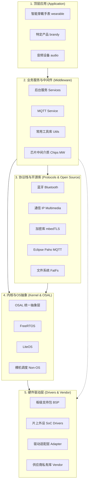

## 架构与核心层

该 SDK 是一个用于可穿戴设备和物联网设备（例如宠物追踪器）的综合性嵌入式 C/C++ 项目。它分为以下几个不同的层级：

### 1. 应用层 (`application/`)

包含高层业务逻辑和面向用户的应用程序。

- **`wearable/`**：可穿戴/追踪设备的主体应用逻辑。包含 `alipay`（支付宝）、`auto_ota`（空中升级）、OpenHarmony 依赖库 (`ohos_deps`/`ohos_startup`) 以及通用设备服务。
- **`wstp/`**：主要涉及 AT 命令处理和蓝牙命令管理（例如您之前看过的 `bt_manager_cmd_manager.c`）。
- **`audio/` & `samples/`**：音频处理逻辑和示例代码。

### 2. 中间件与服务 (`middleware/`)

将复杂功能进行抽象，提供可复用的服务。

- **`services/`**：核心设备服务，包括 `gpu`、`gui`（UI 框架）、`media`（多媒体）、`nfc`（近场通信）、`srv_gnss`（GPS/定位服务）以及 `srv_tiot_host`（腾讯物联网/云端连接）。
- **`utils/`**：通用工具函数和辅助代码。

### 3. 操作系统与内核 (`kernel/`)

提供实时操作系统 (RTOS) 及相关抽象层。

- **支持的 OS**：支持 `freertos`、`liteos`，甚至提供裸机运行方案 (`non_os`)。
- **`osal/`**：操作系统抽象层 (OSAL)，让上层代码无需关心底层所使用的具体 RTOS，实现解耦。

### 4. 硬件与驱动 (`drivers/`, `product/`, `vendor/`)

- **`drivers/`**：底层的外设驱动（I2C、SPI、UART 等）。
- **`product/`**：针对特定板卡和产品的配置。包含 
    
    Kconfig 配置文件以及适用于具体产品的子目录（如 `board/`、`sensor/`、`tiot/`）。
- **`vendor/`**：第三方供应商代码或特定芯片/模组的支持代码（例如 `alipay_sdk`、`segger`、`sikey`）。

## 构建系统

该项目使用自定义的 Python 脚本包装了 **CMake** 和 **Ninja** (或 Make) 来进行构建。

- **
    
    build.py**：编译项目的主入口。它负责解析命令行参数（如 `-j` 指定线程数，`-release/-debug` 指定编译版本，`-project=`，`-version=`），设置环境变量，并调用 CMake。它还会自动生成版本号头文件 (`watch_version.h`)。
- **
    
    CMakeLists.txt (根目录)**：CMake 的总配置文件。它配置了编译器参数，包含了位于 `build/cmake/` 目录下的各种构建脚本，并将各个子目录（`application`、`kernel`、`middleware` 等）加入编译。该文件还负责控制 ROM/RAM 组件的构建，并最终生成 `.bin` 和 `.elf` 固件文件。

## 第三方与开源库

- **`open_source/`**：项目中使用的各种开源代码库。
- **`protocol/`**：网络和通信协议栈（例如 MQTT、CoAP 及可能的自定义通信协议）。

